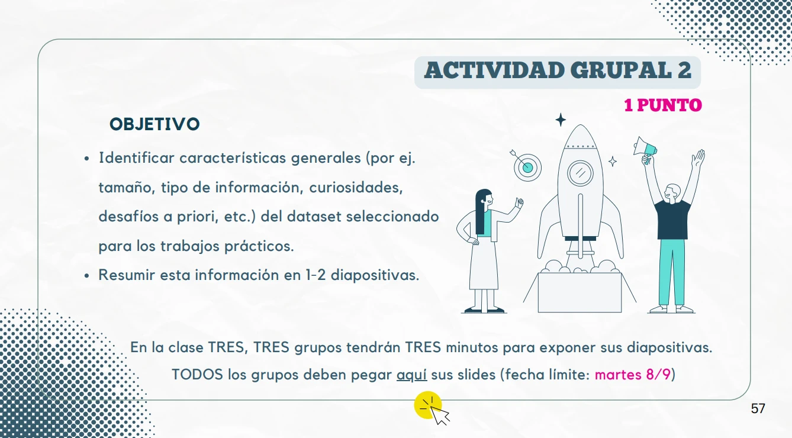

# Análisis de Datos

_29 de septiembre de 2026, Santiago Acevedo, Sofía Picasso, Nicolás Hasbún A._

Trabajo Final del curso **Análisis de Datos** del Laboratorio de Sistemas Embebidos de la
Universidad de Buenos Aires.

## Proposal

## Instructions

- Using the `uv` tool:
    - Run `uv venv -p 3.14 venv`
    - Run `source venv/bin/activate`
    - Run `uv pip install -r requirements.txt`
- Inside vscode, select the Python interpreter we just created for the kernel of the Jupyter
  notebook.
